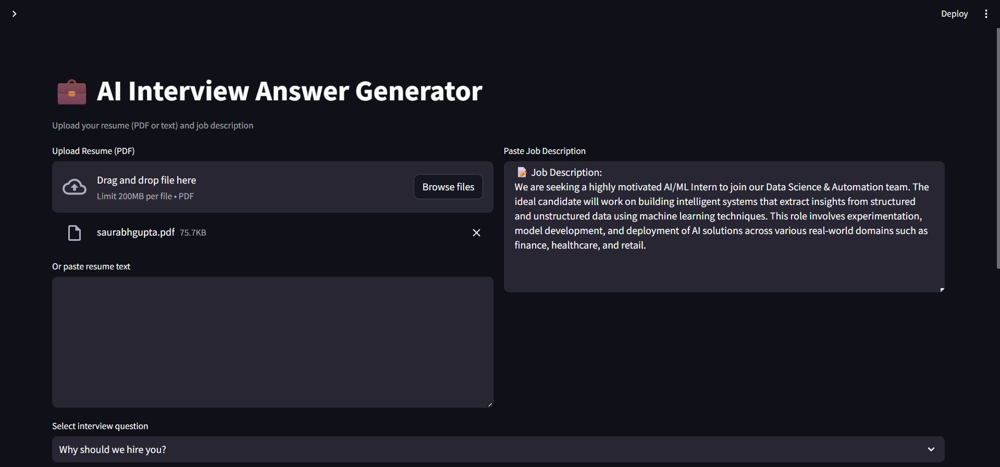

# 💼 AI Interview Answer Generator

An AI-powered interview assistant that generates tailored answers to common interview questions using your resume and the job description. Built using **Streamlit**, **Google Gemini API**, and **Python**.

---

## 🚀 Features

- 📄 Upload your resume as a PDF or paste the text directly
- 📝 Provide the job description for better context
- ❓ Choose from common interview questions or ask a custom one
- 🤖 Uses Gemini 1.5 Pro (fallback to 1.0) for generating high-quality answers
- 📥 Download the generated answer as a `.txt` file
- 🔐 API key secured via `.env` file

---

## 🖼️ Sample Screenshot




## 🛠️ How to Run

1. **Install dependencies**

```bash
   pip install -r requirements.txt
```
2. **Create a .env file in the root directory and add your Gemini API key:**
```bash
GEMINI_API_KEY=your_api_key_here
```

3. **Start the app**

```bash
  python -m streamlit run app.py
```
---

## 📁 Folder Structure
📦 AI-Interview-Answer-Generator/
├── app.py
├── .env
├── requirements.txt
├── README.md
├── images/
│   └── app_screenshot.png
└── utils/
    ├── prompts.py
    └── pdf_parser.py


## 🔒 Notes
Resume must be in PDF or plain text format.

Job description should include specific details for best results.

API key is stored securely and excluded from Git with .gitignore.

## 🙋‍♀️ About
Developed as an AI-based interview preparation tool to help candidates craft better, more relevant answers tailored to specific job roles. Ideal for students, professionals, and job seekers looking to enhance their interview readiness.